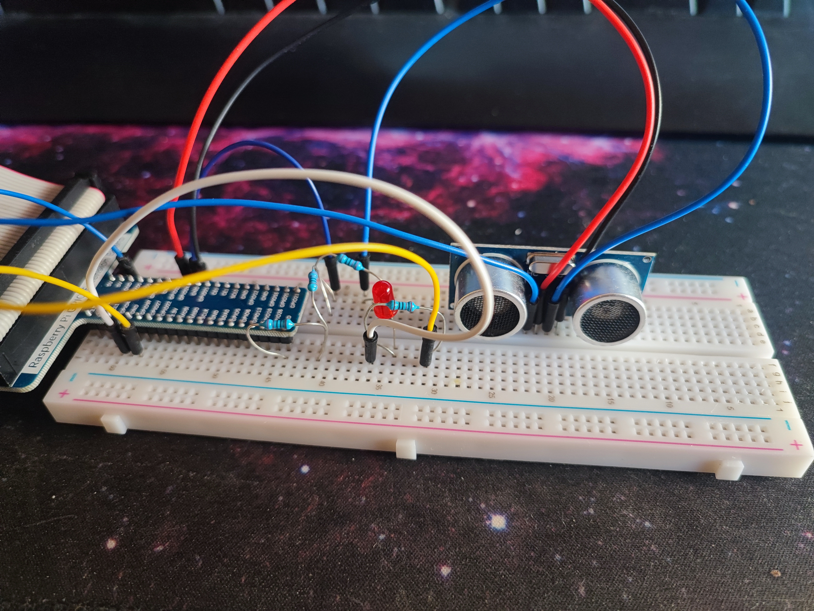

# robotics_level_01
Basic ML robotics project with Raspberry Pi 4

## 1. Main goal
This robotics project involves using a Raspberry Pi to predict the distance of an object using ultrasonic sensors. If the predicted distance falls below 10 cm, an LED is illuminated as an alert.

A great way to get started with basic knowledge.

### Key Features

- **Distance Measurement**: Utilizes ultrasonic sensors to measure distances.
- **Prediction Model**: Incorporates a machine learning model to predict future distances.
- **LED Alert**: Lights up an LED if the predicted distance is less than 10 cm.
- **Learning Oriented**: Designed to provide hands-on experience with hardware and software in robotics.

## 2. Materials Required

- **Raspberry Pi**: Acts as the central processing unit for the project.
- **Ultrasonic Sensor**: Measures the distance to objects.
- **LED**: Serves as an indicator for proximity alerts.
- **Cables**: For connecting the components.
  
## 3. Code explanation
- The script ml_model.ipynb is a code for a super simple Linear Regression model from an Excel hosted in the data folder, because we don't need anything super complicated to start, is a pretty easy *(dumb)* example.
- The Raspberry code is the code for all the electronics and the logic of predicting the next distance and acting depending on the prediction.

## 4. Extras
**Note**: This README is a basic guide and assumes a fundamental understanding of Raspberry Pi, Python programming, and basic electronics. For detailed instructions and troubleshooting, you can contact me at enrique1999gilgarcia@gmail.com

- View from the **front**.

- View from the **top**.

- **Connections** (using GPIO.setmode(GPIO.BOARD))
1. ledPin = 11   # ledPin
2. trigPin = 16  # Ultrasound
3. echoPin = 18  # Ultrasound
